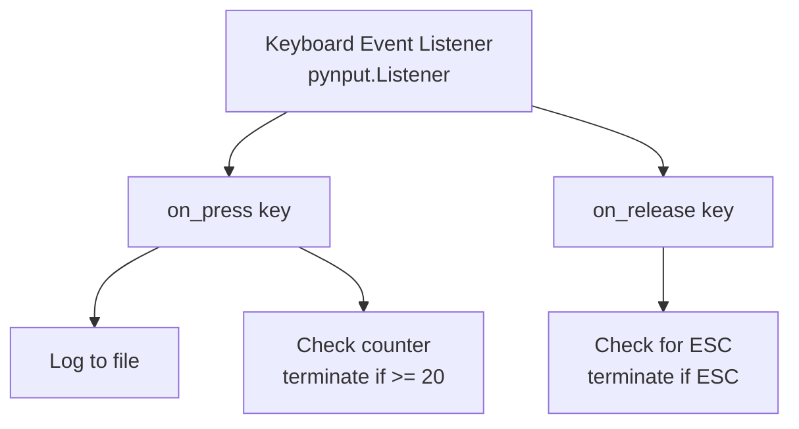

# Keyboard-Event-Logger
A system monitoring tool that captures and logs input from a keyboard. 

## Educational Security Research Project
Note: Source code is not publicly available to prevent misuse. This README documents the project for portfolio and educational purposes only.

### Project Overview
A Python-based system event monitoring application developed for cybersecurity education to understand input capture mechanisms and security vulnerabilities in controlled lab environments. This project demonstrates proficiency in event-driven programming, system-level interactions, and defensive security analysis.

### Purpose
This tool was created as part of a personal project to:
- Understand how input capture vulnerabilities work at a technical level
- Learn about event-driven architecture and callback functions
- Analyze security implications of system monitoring
- Study defensive programming practices and intrusion detection
- Develop awareness of common attack vectors to strengthen defensive strategies

### Implementation
**Language:** Python 3.x  
**Primary Library:** pynput (keyboard event listener)  
**Architecture:** Event-driven with callback functions  
**Design Pattern:** Observer pattern for event handling

### Architecture

### Core Functionality

#### Event Handling
- Captures keyboard events in real-time
- Processes both alphanumeric characters and special keys
- Implements conditional logic for program termination after 20 keystrokes
- Supports manual termination via ESC key

#### Data Management
- Writes captured events to log.txt in write mode
- Formats output by removing extraneous characters (single quotes)
- Adds spacing between keystrokes for readability
- Maintains persistent log throughout program execution

#### Program Control
- Global counter tracking number of keys pressed
- Conditional termination using sys.exit(0) after threshold reached
- Alternative termination via ESC key detection
- Clean shutdown with proper listener cleanup
